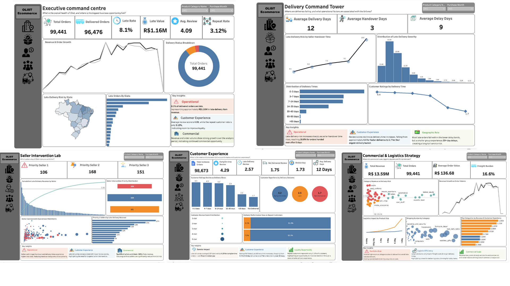

# Olist E-Commerce Analytics

### Delivery Performance · Customer Experience · Seller Risk · Commercial Strategy

> **An end-to-end investigation of 99K+ Olist e-commerce orders to identify delivery risks, understand their relationship with customer experience, quantify commercial exposure, prioritize seller interventions, and translate the analysis into an interactive Tableau solution.**

**99K+ Orders Analyzed · 14 Business Questions · 5 Interactive Dashboards**

**Excel · Python · SQL · Tableau**

---

# 1. Business Problem

Olist operates across a large marketplace of sellers, customers, products, and logistics flows. Delivery performance therefore has implications beyond operational efficiency, particularly when delivery issues coincide with weaker customer experience and meaningful commercial exposure.

The central business question for this analysis is:

> **How can Olist reduce delivery-related customer experience risk while protecting commercially important revenue and improving operational focus?**

Rather than treating late delivery as an isolated KPI, the analysis connects:

**Delivery Performance → Operational Risk → Customer Experience → Commercial Exposure → Seller Risk**

The objective was to move beyond simply measuring *how many orders were late* and investigate:

> **Where is the risk concentrated, what patterns are associated with it, what is commercially important, and where should operational attention be focused first?**

---

# 2. Analytical Objectives

The analysis was designed around four core objectives:

### Measure

Establish the scale, severity, and geographic distribution of delivery performance.

### Understand

Examine the relationship between delivery outcomes and customer experience.

### Quantify

Evaluate commercially relevant exposure, freight burden, category performance, and logistics characteristics.

### Prioritize

Identify sellers and commercial areas where operational risk and business importance intersect.

---

# 3. Business Questions

The broader business problem was translated into **14 structured analytical questions**.

### Delivery & Operations

1. Which states have the highest late-delivery rates?
2. Which sellers show weaker delivery performance?
3. How does seller-to-carrier handover time relate to late deliveries?
4. What merchandise value is associated with late deliveries?
5. Which categories combine high commercial value with delivery risk?
6. How do product dimensions and weight relate to logistics performance?

### Customer & Commercial Performance

7. Which categories carry higher shipping burdens?
8. How does delivery performance differ between new and repeat customers?
9. What is the financial contribution of repeat customers?
10. Which categories combine commercial scale with operational risk?
11. Which commercially important sellers also show elevated delivery risk?

### Prioritization & Strategy

12. Which sellers should Olist prioritize for intervention?
13. How has revenue evolved across customer and product segments?
14. Which categories combine revenue scale with customer-experience risk?

---

# 4. Data & Analytical Scope

The analysis uses the **Brazilian E-Commerce Public Dataset by Olist**, covering multiple dimensions of marketplace activity:

**Orders · Order Items · Customers · Sellers · Products · Payments · Reviews · Delivery Timestamps · Geography**

## Dataset Scale

| Metric | Value |
|---|---:|
| Unique Orders | **99,441** |
| Analytical Rows | **113,425** |
| Order-Item Rows | **112,650** |
| Order-Header Rows | **775** |

## Analytical Grain

The final analytical model uses:

> **One row per order item, plus one order-header row for orders without item records.**

This distinction was important because the project combines order-level and item-level information.

Order-level payment and review data were **pre-aggregated before integration with item-level data** to prevent many-to-many duplication and preserve metric integrity.

---

# 5. Data Preparation & Quality Assurance

Before performing deeper analysis, the data was prepared and validated to establish a reliable analytical foundation.

## Excel — Initial Data Preparation

Excel was used for:

- Data cleaning
- Data-quality checks
- Field inspection
- KPI validation
- Initial exploratory analysis
- Cross-checking source datasets

## Data Integrity Controls

The analytical model was validated for:

- Duplicate order-item combinations
- Missing core identifiers
- Payment reconciliation
- Review coverage
- Revenue consistency
- Freight consistency
- Product and seller matching
- Timestamp anomalies

## Key Modeling Decision

A major focus was **analytical grain control**.

Rather than directly joining all source tables together, order-level payment and review information were aggregated before being connected to item-level information.

This prevented duplicated measures and helped ensure that downstream SQL and Tableau calculations remained analytically defensible.

---

# 6. Exploratory Data Analysis

## Python | Google Colab

After establishing the initial data foundation in Excel, Python was used to investigate the data more deeply.

The exploratory analysis examined:

- Delivery-time distributions
- Delay severity
- Geographic variation
- Seller performance
- Customer experience
- Revenue and order trends
- Freight burden
- Product characteristics
- Category performance
- Outliers and anomalies

Python also served as a validation layer for patterns identified during the initial exploration.

### Analytical Progression

**Prepare → Explore → Validate**

---

# 7. Structured SQL Analysis

Once the major patterns were established, the investigation was formalized into **14 SQL analytical views**.

SQL was used to transform broad business questions into structured, reusable analytical outputs covering:

**Delivery · Geography · Sellers · Customers · Categories · Revenue · Freight · Logistics · Risk Prioritization**

## SQL Techniques

- Multi-table joins
- Common Table Expressions (CTEs)
- Aggregations
- CASE logic
- Window functions
- Segmentation
- Quartile-based prioritization
- Business-rule classification

The SQL layer served as the bridge between exploratory analysis and the final analytical model.

### Analytical Progression

**Explore → Structure → Validate**

---

# 8. Key Findings

## 8.1 Delivery Performance & Customer Experience

The overall late-delivery rate was:

### **8.11%**

The customer-experience difference between delivery outcomes was substantially larger than the headline delivery KPI alone suggests.

| Delivery Outcome | Average Review |
|---|---:|
| Early / On-Time | **4.29 / 5** |
| Late | **2.57 / 5** |

### **1.72-point review-score gap**

Late delivery was associated with substantially weaker customer ratings.

> **Interpretation:** This finding represents an association between delivery performance and review scores. It does not establish that late delivery alone caused the lower ratings.

---

## 8.2 Seller-to-Carrier Handover

The analysis identified a clear pattern between handover time and late-delivery rate.

| Handover Time | Late Rate |
|---|---:|
| 0–1 days | 4.09% |
| 1–2 days | 5.96% |
| 2–3 days | 7.23% |
| 3–5 days | 8.10% |
| >5 days | **16.60%** |

The **>5-day handover group had approximately 4.06× the late-delivery rate** of the 0–1-day group.

This identifies seller-to-carrier handover as an important operational signal for further investigation.

---

## 8.3 Commercial Exposure

Approximately:

### **R$1.159M**

of merchandise value was associated with late deliveries.

This represents **late-delivery merchandise exposure**, rather than confirmed lost revenue, refunds, or profit loss.

The finding demonstrates why delivery performance should be evaluated alongside commercial scale.

---

## 8.4 Geographic Risk

Delivery performance varies substantially across states.

The analysis deliberately considers both:

**Late-delivery rate**

and

**Absolute number of late orders**

For example:

- **Alagoas — 23.93% late rate**
- **Rio de Janeiro — largest absolute number of late orders**

This distinction matters because a high late rate and a high number of affected orders represent different types of operational priority.

---

## 8.5 Seller Intervention Prioritization

For sellers with at least **50 delivered orders**, a relative intervention framework was developed using:

**Late-delivery exposure + Late rate + Delay severity**

The resulting segmentation identified:

| Priority | Sellers |
|---|---:|
| **Priority 1** | **106** |
| **Priority 2** | **168** |
| **Priority 3** | **151** |

This provides a structured way to allocate operational attention rather than treating all seller risk equally.

---

## 8.6 Revenue Growth

Monthly revenue increased from approximately:

**R$246K → R$1.084M**

between February 2017 and May 2018.

### **~341% growth**

Monthly orders and revenue showed approximately **0.99 correlation**, while AOV showed substantially weaker relationships with both.

The observed revenue expansion was therefore primarily associated with **transaction-volume growth**.

---

## 8.7 Freight & Logistics

The analysis identified:

| Metric | Value |
|---|---:|
| Merchandise Revenue | **R$13.59M** |
| Freight Value | **R$2.25M** |
| Weighted Freight Burden | **16.57%** |

Product characteristics also showed meaningful differences in freight and delivery performance.

For example:

| Weight | Avg. Freight | Avg. Delivery | Late Rate |
|---|---:|---:|---:|
| 0–500g | R$15.24 | 11.51 days | 7.36% |
| >10kg | R$54.62 | 14.98 days | 10.33% |

These patterns are treated as operational associations rather than causal effects.

---

## 8.8 Commercial Scale & Customer Experience

Category analysis identified four strategic groups:

| Category Segment | Number of Categories |
|---|---:|
| High Revenue & Strong CX | **4** |
| High Revenue but CX Risk | **9** |
| Lower Revenue but Strong CX | **11** |
| Mixed Performance | **28** |

This provides a more strategic view than ranking categories by revenue alone.

---

# 9. Insight Synthesis

The individual findings become more meaningful when viewed together.

### 01 — Delivery performance is also a customer-experience signal

The review-score gap makes delivery performance relevant beyond operational efficiency.

### 02 — Handover time is an important operational signal

Longer handover groups show materially higher late-delivery rates, identifying seller-to-carrier handover as an area for further investigation.

### 03 — Risk is unevenly distributed

Geography, sellers, categories, and product characteristics do not carry the same level of delivery risk.

### 04 — Commercial exposure should influence prioritization

Delivery problems become more strategically important when they coincide with meaningful merchandise exposure.

### 05 — Growth and logistics should be evaluated together

Revenue expansion should be considered alongside freight burden and delivery performance rather than evaluated in isolation.

### Analytical Progression

**Prepare → Explore → Structure → Validate → Interpret → Prioritize → Visualize**

---

# 10. Interactive Business Intelligence

After completing the data preparation, exploratory analysis, SQL investigation, and insight synthesis, the analytical outputs were translated into an interactive **Tableau business-intelligence solution**.

The objective was not simply to reproduce charts.

The dashboards were designed to allow stakeholders to move from:

> **What is happening? → Where is it happening? → What patterns are associated with it? → Who should we focus on?**

## Tableau Dashboard Suite

### 01 — Executive Command Centre

**Question:**  
*What is the overall health of Olist, and where is the largest business opportunity or risk?*

Provides the executive view of:

- Business KPIs
- Revenue and order trends
- Delivery status
- Geographic risk
- Major business signals

---

### 02 — Delivery Command Tower

**Question:**  
*Where are deliveries underperforming, and what operational factors are associated with the pattern?*

Focuses on:

- Late-delivery performance
- Handover patterns
- Delay severity
- Delivery-time distribution
- Geographic performance
- Customer ratings

---

### 03 — Seller Intervention Lab

**Question:**  
*Which sellers should Olist prioritize for intervention?*

Connects:

- Seller risk
- Late rate
- Delay severity
- Commercial exposure
- Intervention priority

---

### 04 — Customer Experience

**Question:**  
*What is the relationship between delivery performance and customer experience?*

Examines:

- Review scores
- Delivery outcomes
- Delivery-time bands
- New vs. repeat customers
- Customer and revenue contribution

---

### 05 — Commercial & Logistics Strategy

**Question:**  
*Where do commercial scale, logistics burden, and customer-experience risk intersect?*

Connects:

- Category revenue
- Delivery risk
- Freight burden
- Product characteristics
- Revenue growth
- Customer experience

---

## Tableau Portfolio View

**[→ View the Interactive Tableau Dashboard on Tableau Public](https://public.tableau.com/views/olistecommercedashboard/ExecutiveDashboard?:language=en-US&:sid=&:redirect=auth&:display_count=n&:origin=viz_share_link)**

*The five dashboards represent one integrated analytical solution rather than five separate projects.*

---

# 11. Project Deliverables

| Deliverable | Purpose |
|---|---|
| **Excel EDA** | Data preparation, validation & initial exploration |
| **Python EDA** | Deeper exploratory & relationship analysis |
| **SQL Analysis** | 14 structured business questions |
| **Analytical Master Dataset** | Integrated analytical model |
| **Tableau Workbook** | Interactive business-intelligence solution |
| **Field Guide** | Data definitions, grain & metric usage |
| **Executive Analysis** | Consolidated findings & interpretation |

---

# 12. Recommendations

The recommendations below are derived from the combined operational, customer, commercial, and seller-level findings.

### 01 — Prioritize Seller Intervention Using Risk + Exposure

Focus operational attention on sellers where weaker delivery performance coincides with meaningful commercial exposure.

### 02 — Investigate Long Seller-to-Carrier Handover Times

The >5-day handover group shows materially higher late-delivery rates and warrants investigation into dispatch discipline, pickup coordination, and carrier handoff processes.

### 03 — Protect Commercially Important Categories with CX Risk

Categories combining meaningful commercial scale with weaker customer-experience outcomes should receive targeted operational investigation.

### 04 — Use Both Geographic Rate and Volume

State-level intervention should consider both **severity of the late rate** and **absolute number of affected orders**.

### 05 — Monitor Logistics Economics Alongside Growth

Revenue growth should be evaluated together with freight burden and delivery performance to identify areas where commercial expansion may coincide with increasing operational pressure.

---

# 13. Limitations & Analytical Guardrails

A rigorous analysis should also make clear what the available data can and cannot establish.

### Association ≠ Causation

The analysis identifies relationships between delivery performance and customer experience but does not establish that late delivery independently caused lower ratings.

### Exposure ≠ Financial Loss

The R$1.159M figure represents merchandise value associated with late deliveries. It should not be interpreted as confirmed lost revenue, refunds, or profit loss.

### Prioritization ≠ Prediction

The seller intervention framework is a relative prioritization model based on historical performance. It is not a predictive machine-learning model.

### Operational Signal ≠ Root Cause

Patterns involving handover time, geography, product characteristics, or categories identify areas for investigation. They do not establish confirmed operational root causes.

### Historical Data ≠ Current Performance

The analysis is based on historical Olist marketplace data and should not automatically be interpreted as a representation of current operational conditions.

### Analytical Grain Matters

Order-level, order-item-level, seller-level, and category-level metrics operate at different analytical grains. Metrics should therefore be aggregated according to their defined level of analysis.

---

# 14. Final Business Takeaway

The most important outcome of this project is not simply that **8.11% of delivered orders were late**.

The larger opportunity lies in connecting **delivery performance, customer experience, commercial exposure, and seller-level risk** to determine where operational attention is most valuable.

The analysis identified:

- A substantial customer-experience gap between late and early/on-time deliveries
- A strong operational pattern around extended seller-to-carrier handover
- Meaningful merchandise exposure associated with late deliveries
- Uneven geographic and category-level risk
- A structured population of sellers requiring different levels of intervention

The final Tableau solution turns these findings into an interactive business-intelligence experience, while the underlying Excel, Python, and SQL work provides the analytical foundation behind the insights and recommendations.

## The Complete Analytical Journey

**Business Problem → Questions → Data → Preparation → Exploration → Analysis → Evidence → Insight → Prioritization → Visualization → Recommendations**

---

# 15. Data Source

The project uses the **Brazilian E-Commerce Public Dataset by Olist**, containing anonymized marketplace information covering orders, customers, sellers, products, payments, reviews, and logistics-related attributes.

Raw source data is intentionally excluded from this public repository. The repository focuses on the analytical work, methodology, SQL analysis, visualizations, and supporting documentation.

---

# 16. Skills Demonstrated

### Data Preparation & Quality

Excel · Data Cleaning · Data Validation · Data Quality Assurance · Analytical Data Modeling

### Exploratory Analysis

Python · Pandas · NumPy · Matplotlib · Exploratory Data Analysis · Segmentation · Relationship Analysis · Anomaly Investigation

### SQL Analytics

SQL · Joins · CTEs · Aggregations · Window Functions · CASE Logic · Business Views · Segmentation · Prioritization

### Business Intelligence

Tableau · Data Modeling · Calculated Fields · KPI Design · Interactive Dashboards · Geographic Analysis · Risk Segmentation

### Business Analysis

Problem Framing · KPI Development · Operational Analysis · Commercial Analysis · Customer Experience Analysis · Seller Prioritization · Decision Support

### Environment

Google Colab
